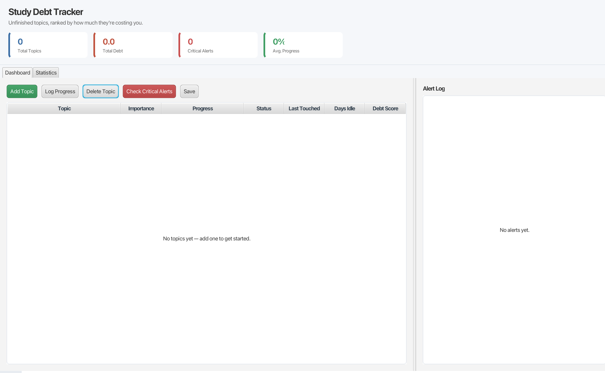
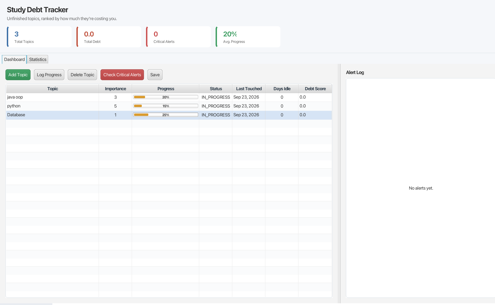
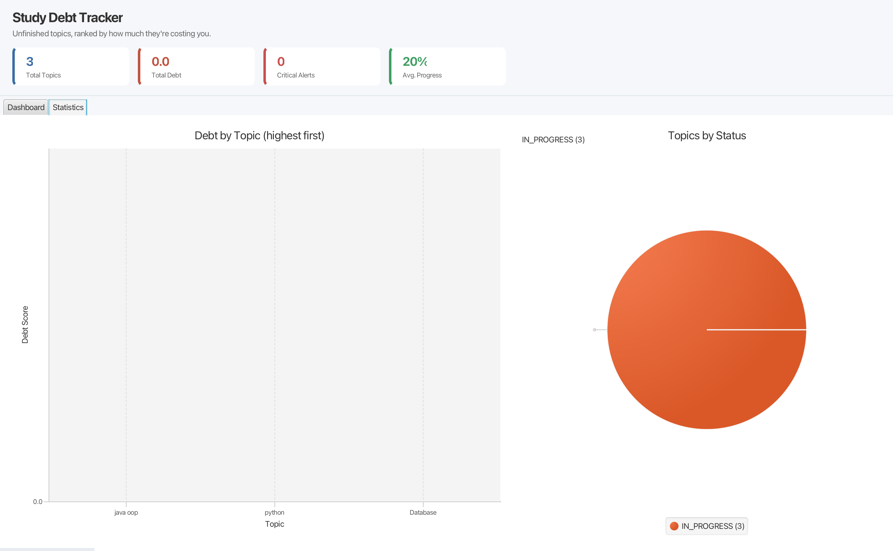

# Study Debt Tracker

A JavaFX desktop app (with a console version also included) that tracks
unfinished learning — courses and topics you started but never came back to —
and scores them by how much "debt" they've accumulated, the same way
unfinished work becomes technical debt in software.

## The idea

Every learner has a pile of half-finished topics: a course you were 40%
through and abandoned, a tutorial you bookmarked and forgot. This app makes
that pile visible and ranks it, so you know exactly what to pick back up
first.

## The debt formula

```
debtScore = importanceWeight × daysSinceLastTouched × (1 − progressRatio)
```

- **importanceWeight** (1–5): how much this topic matters to you
- **daysSinceLastTouched**: how long it's been ignored
- **progressRatio**: how close to finished it already is (0.0–1.0)

A topic you're 90% through decays slowly — there's little left to forget.
A high-importance topic you haven't touched in three weeks decays fast.
Finished topics (100%) never accumulate debt.

The formula is deliberately simple and swappable — see **Design patterns**
below for how a different formula (e.g. exponential decay) could be added
without touching any other class.

## Features

- **JavaFX desktop dashboard** — a real GUI (`com.studydebt.ui.MainApp`), not just a console menu
  - Stat cards: total topics, total debt, critical-alert count, average progress
  - Sortable table of every topic, ranked by debt (most neglected first), with a
    live progress bar per row and critical rows highlighted in red
  - Buttons to add a topic, log progress, delete a topic, run a critical-debt
    check, and save
  - An **Alert Log** panel plus popup dialogs whenever topics cross the
    critical debt threshold
  - A **Statistics** tab with a bar chart of debt-by-topic and a pie chart of
    status distribution
  - Auto-loads/saves `data.json`, including on window close
- A plain console version (`com.studydebt.Main`) is still included
- Log study progress against any topic
- View all topics ranked by debt score, most neglected first
- Automatic alerts when a topic crosses a critical debt threshold
- Data persists to `data.json` between runs

## Screenshots

**Empty dashboard on first launch**



**Dashboard with topics, progress bars, and stats populated**



**Statistics tab — debt by topic and status breakdown**



## Getting started

Requires Java 21+ and Maven.

**Run the JavaFX desktop dashboard:**

```bash
mvn javafx:run
```

**Run the plain console version instead:**

```bash
mvn compile
mvn exec:java
```

Run the test suite:

```bash
mvn test
```

## Architecture

```
com.studydebt
├── model/         Topic, Course, Status — core domain, no dependencies on anything else
├── service/        DebtCalculator, DecayStrategy, DebtMonitor — business logic
├── repository/      TopicRepository — in-memory storage, swappable for a real DB later
├── persistence/     JsonTopicStore — save/load to disk
├── ui/              MainApp (JavaFX dashboard), GuiAlertListener — desktop front-end
└── Main             console entry point, wires everything together
```

The JavaFX layer (`ui/`) doesn't change any existing class — it's a second
front-end wired onto the same `TopicRepository`, `DebtCalculator`, and
`DebtMonitor` the console app uses. `GuiAlertListener` is just another
`DebtAlertListener` implementation (see Observer below), subscribed instead
of / alongside `ConsoleAlertListener`.

Data flows one direction: `Main` → `service` → `repository`/`persistence`.
The domain model (`model` package) never depends on anything else, so it
stays easy to test in isolation.

## Design patterns used

| Pattern | Where | Why |
|---|---|---|
| **Strategy** | `DecayStrategy` / `LinearDecayStrategy` | `DebtCalculator` depends on the `DecayStrategy` interface, not a concrete formula. A new decay algorithm (e.g. exponential) can be added by implementing the interface — no existing code changes. |
| **Observer** | `DebtAlertListener` / `DebtMonitor` | `DebtMonitor` notifies any number of subscribed listeners when a topic becomes critical, without knowing what they do with that information. `ConsoleAlertListener` prints to the console; `GuiAlertListener` feeds the JavaFX dashboard's Alert Log instead — same interface, no changes to `DebtMonitor`. |
| **Repository** | `TopicRepository` | Isolates storage from business logic. The rest of the app talks to an interface-shaped repository, not directly to a data structure or file — swapping in a real database later wouldn't touch `service` or `Main`. |
| **DTO / boundary mapping** | `TopicRecord` | `Topic` never gets Jackson annotations or persistence concerns; `JsonTopicStore` converts to/from a separate `TopicRecord` at the boundary, keeping the domain model clean. |

## Testing

35+ JUnit 5 tests covering the domain model, business logic, repository, and
persistence layer — including edge cases (invalid input, empty collections,
boundary values), not just happy paths.

## Possible next steps

- Swap `LinearDecayStrategy` for an exponential decay curve
- Add a `Course` view that groups topics and shows aggregate debt
- Replace `JsonTopicStore` with a real database via a new `TopicRepository` implementation
- Package the JavaFX app as a native installer (`jpackage`) for one-click install
